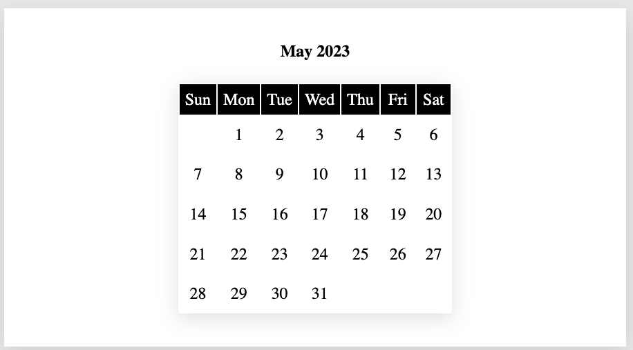

# How to Create a Monthly Calendar Using HTML, CSS and JavaScript




You are going to learn how to create a monthly calendar using html, css and javascript. 

Use the JavaScript’s `Date` object to get the current month and year and generate a calendar according to the month. 

Below is a step-by-step coding tutorial. 

- Get the source code for this project by clicking on here; [Source Code](https://github.com/DrVicki/my-claendar).

## Instructions

1. Open VS Code
2. Click on "Terminal" at the top
3. Move to your desktop.
	- `cd desktop`
4. Create project folder
	- `mkdir my-calendar`
5. Change Directory to your project
	- `cd my-calendar`
6. Create 3 files: `index.html`, `styles.css`, and `script.js`
	- `touch index.html`
	- `touch styles.css`
	- `touch script.js`
7. Save your work
	- "File" and top of screen
	- "Save All"

## Code the Calendar

1. **Set up HTML**
	- Add the boiler plate of the `html` document
	- inside `body` create container `div`. 
	- in the `div` container create an `h2` tag to display the current month and year. 
	- use `table` tag to build the calendar for the current month and year.

```
// index.html

<!DOCTYPE html>
<html lang="en">
  <head>
    <meta charset="UTF-8" />
    <meta http-equiv="X-UA-Compatible" content="IE=edge" />
    <meta name="viewport" content="width=device-width, initial-scale=1.0" />
    <title>My Calendar</title>
    <link rel="stylesheet" href="styles.css" />
  </head>
  <body>
    <div class="container">
      <h2 id="info"></h2>
      <table id="calendar">
        <thead id="days"></thead>
        <tbody id="dates"></tbody>
      </table>
    </div>
    <script src="script.js"></script>
  </body>
</html>
```

2. **Add JavaScript**

- All the data you are going to display will come from the javascript.

Function `createCalendar` will accept `year` and `month` as `input` parameters. 

**First**: define three variables `date`, `days` and `monthNames`. 

- Date will contain the current `date`, 
- `days` and `monthNames` will contain the name of the days and name of the months respectively. See the below code for reference.

**Next**: create a variable  `year_and_month`, a string which contains the current month and the year. 

- `date.getMonth()` will return the current index of the month. 
- Using that index we will get the name of the month.

**Next**:  add the day names to the `html` using the `for` loop for `days`.

**Now**: to create a calendar we need to know the `firstDay` of the month and the `numberOfDays` it is going to have. 

- Use the `firstDay` of the month to add the `date` to the day on which it starts. 
- Use `numberOfDays` to add rest of the dates to the calendar.

Navigate to the `script.js` file to follow the coding of the requirements above.

```
// script.js

function createCalendar(year, month) {
	const date = new Date(year, month - 1)
	const days = ["Sun", "Mon", "Tue", "Wed", "Thu", "Fri", "Sat"]
	const monthNames = ["January", "February", "March", "April", "May", "June", "July", "August", "September", "October", "November", "December"]
  
	let year_and_month = `${monthNames[date.getMonth()]} ${year}\n`
	document.getElementById("info").textContent = year_and_month
  
	let tableDays = document.getElementById("days")
	for (let i = 0; i < days.length; i++) {
	  let td = document.createElement("td")
	  td.textContent = days[i]
	  tableDays.appendChild(td)
	}
  
	let firstDay = new Date(year, month - 1, 1).getDay()
	let numberOfDays = new Date(year, month, 0).getDate()
  
	let tableDates = document.getElementById("dates")
	for (let i = 0; i < firstDay; i++) {
	  let td = document.createElement("td")
	  tableDates.appendChild(td)
	}
  
	for (let i = 1; i <= numberOfDays; i++) {
	  let td = document.createElement("td")
	  td.textContent = i
	  tableDates.appendChild(td)
	  if ((i + firstDay) % 7 == 0) {
		let tr = document.createElement("tr")
		tableDates.appendChild(tr)
	  }
	}
  }
  
  let currentYear = new Date().getFullYear()
  let currentMonth = new Date().getMonth() + 1
  
  createCalendar(currentYear, currentMonth)
  ```

  3. **Style the Calendar**

	Now the fun and easy part; add styling with CSS. 

	- You can refer to the below `css` styles or you can create your own styles.

```
// styles.css

* {
  margin: 0;
  padding: 0;
  box-sizing: border-box;
}

body {
  padding: 5rem 0;
  background-color: #ebebeb;
}

.container {
  max-width: 900px;
  margin: 0 auto;
  background-color: #fff;
  padding: 3rem;
  display: flex;
  flex-direction: column;
  align-items: center;
  box-shadow: rgba(100, 100, 111, 0.2) 0px 7px 29px 0px;
}

table {
  margin-top: 2rem;
  box-shadow: rgba(100, 100, 111, 0.2) 0px 7px 29px 0px;
}

.container #calendar #days * {
  padding: 0.5rem;
  background-color: #000;
  color: #fff;
  text-align: center;
  font-size: 1.5rem;
}

.container #calendar #dates td {
  text-align: center;
  padding: 0.8rem;
  font-size: 1.5rem;
}
```

### Congratulations on Completing this project. 

